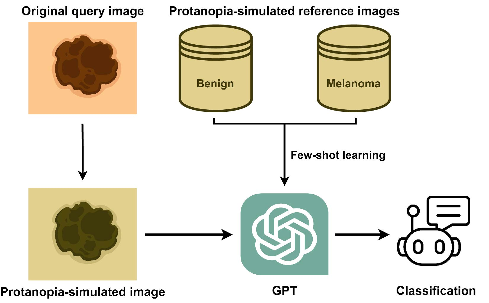

# Color Vision Deficiency (CVD) Dermoscopic Image In-Context Learning (ICL) with GPT4v
[](LICENSE)

This repository contains code and data for performing Color Vision Deficiency-Accommodated Dermoscopic Classification with GPT-4V.



## Requirements
1. numpy
2. PIL
3. daltonLens
4. json
5. openai
6. base64
7. pandas

## Repository Structure

```
.
├── data                                     # Contains subdirectories for processed data
│   ├── all
│   ├── all_resized
│   ├── all_resized_brettel_protan_1
│   ├── all_resized_brettel_deutan_1
│   ├── all_resized_brettel_tritan_1
│   ├── bn
│   ├── bn_resized
│   ├── bn_resized_label
│   ├── bn_resized_label_brettel_protan_1
│   ├── bn_resized_label_brettel_deutan_1
│   ├── bn_resized_label_brettel_tritan_1
│   ├── mm
│   ├── mm_resized
│   ├── mm_resized_label
│   ├── mm_resized_label_brettel_protan_1
│   ├── mm_resized_label_brettel_deutan_1
│   ├── mm_resized_label_brettel_tritan_1
│   └── selected_images.xlsx                 # Image names
├── RAW                                      # Contains raw data downloaded from ISCI Archive
├── result                                   # Results from running API_calling will be stored here
│   ├── 2_shot_brettel_protan_1         
│   │   ├──rep 1
│   │   └── ...
│   ├── 2_shot_brettel_deutan_1
│   └── ...
├── CVD_classification_GPT.py                # Call OpenAI API for classification
├── CVD_convertor.py                         # Convert original image to CVD simulated image
├── data_labeling.py                         # Add label to the image for reference
├── data_resizing.py                         # Resize the data with the original aspect ratio            
├── data_selection.py                        # Select data from RAW       
└── README.md                           
```

## Data
All the dermoscopic images are downloaded from [ISIC Archive](https://www.isic-archive.com/).


## Disclaimer
This project is for academic research purposes only. The code in this repository is released under the MIT License.
If you use the data provided, please cite the ISIC Archive.
- [](http://creativecommons.org/publicdomain/zero/1.0/)
- [](https://creativecommons.org/licenses/by/4.0/)
- [](https://creativecommons.org/licenses/by/4.0/)

## Color Vision Deficiency (CVD) simulation
For CVD simulation, we picked the [DaltonLens-Python](https://github.com/DaltonLens/DaltonLens-Python) package. It has covered a variety of the currently available algorithms of colorblindness simulation. The [author's blog](https://daltonlens.org/#posts) is also well worth reading.

We have selected the [Brettel et al. 1997](https://vision.psychol.cam.ac.uk/jdmollon/papers/Dichromat_simulation.pdf) as the CVD simulation method and set the severity at 1, which can be adjusted with the provided code as needed.

#### Brettel 1997 CVD simulation exmaple:


Benign example: ISIC_0012656 \
Melanoma example: ISIC_0046725

## General Workflow:
1. Download the raw data from ISIC Archive
2. Select data:
   - run *python data_selection.py --[options]*
3. Process data:
   - run *python data_resizeing.py --[options]*
   - run *python data_labeling.py --[options]*
4. Convert data:
   - run *python CVD_convertor.py --[options]*
5. Call API:
   - run *python CVD_classification_GPT.py --[options]*

## Result:

- ### Accuracy of GPT-4V for classifying dermoscopic images under various CVD simulations.


*(A) Average classification accuracies of GPT-4V for non-simulated and CVD-simulated images (protanopia, deuteranopia, tritanopia). Error bars: standard deviations. \*: p < 0.05; \*\*: p < 0.01 (t-test; two-tail). N.S.: not significant. All experiments were in ten repeats. (B) Classification accuracy of GPT-4V following the application of the consensus strategy across the ten repeats for each image query. GPT-4o (version “gpt-4o-2024-05-13”) included for comparison.*

- ### Comparative analysis of the association between red/pink color and “melanoma” prediction in non-simulated and tritanopia-simulated images. 

GPT-4V adapted its interpretation on color-based findings to different CVD-simulations. Specifically, it did not mention red or pink colors in protanope and deuteranope simulations but associated these colors with a melanoma prediction in non-simulated images. In tritanopia simulations—characterized by prevalent pinkish hues—GPT-4V no longer treated pink as a melanoma feature.


*For each of the non-simulated and tritanopia-simulated conditions, two groups of image inquiries were identified based on GPT-4V’s explanations for its predictions. The first group, labeled “RED,” includes descriptions where red color is mentioned to describe query image, regardless of the pink color. The second group, labeled “PINK,” comprises descriptions exclusively mentioning pink without red. The Y-axis displays the percentage of “melanoma” predictions from each replicate. By default, both the query and reference images were either non-simulated or simulated to the same CVD condition. An ablation test (the last two columns) was done for the tritanopia-simulation by sampling the references from non-simulated images.  \***: p < 0.001 (t-test; two-tail).*

